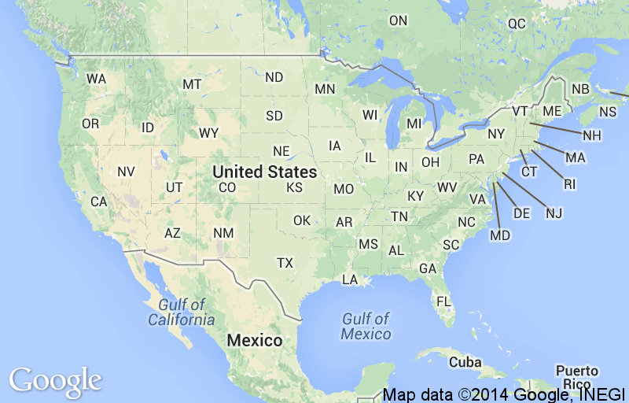

PHP GEDCOM Tools
================

Tools for interacting with GEDCOM (family tree) files. These have only been tested on a very small sample, but maybe they'll come in handy for you.

export-branch.php
-----------------
Export a new GEDCOM file containing only the person specified, their descendants and descendants' spouses, and any events or other entries related to those people.

This is handy for when you have a massive family tree constructed but would like to share only a portion of it with someone else.

Usage:

`./scripts/export-branch.php --gedcom=/path/to/existing-tree.ged --person='John Doe' --out=/path/to/new-tree.ged`

The `--person` argument must match exactly the name of the person you want at the top of the tree.

export-related.php
------------------
Export a new GEDCOM file containing only the person specified and any other people related by blood. This will exclude spouses of blood relatives, but would include, for example, children, grandchildren, cousins, grandparents, and half-siblings.

Usage:

`./scripts/export-related.php --gedcom=/path/to/existing-tree.ged --person='John Doe' --out=/path/to/new-tree.ged`

The `--branch` argument must match exactly the name of the person you want the tree based on.

death-age-stats.php
-------------------
Calculate the average and median age at death for everyone in a GEDCOM file.

Usage:

`./scripts/death-age-stats.php --gedcom=/path/to/existing-tree.ged --age=[minimum age at death] --sex=[M|F]`

The optional `--age` parameter can be used to specify a minimum age at death to find, for example, the median age at death of all family members that didn't die before the age of 30.

The optional `--sex` parameter can be used to filter the results by gender.

Example output:

```
Average age at death: 56 years
Median age at death: 69 years
```

gender-counts.php
-----------------
Tally the count of the genders represented in a GEDCOM file.

Usage: 

`./scripts/gender-counts.php --gedcom=/path/to/existing-tree.ged`

Example output:

```
M:   1340
F:   1198
```

date-histogram.php
------------------
Print a histogram of date (month/day) frequencies for a given event type.

Usage: 

`./scripts/date-histogram.php --gedcom=/path/to/existing-tree.ged --type=[BIRT|DEAT|MARR] --specificity=[day|month]`

Supported `--type` values are `BIRT` (birth), `DEAT` (death), and `MARR` (marriage).

Supported values for the optional `--specificity` argument are `day` and `month`.

Example output using `--specificity=day`.

```
01-01   XX
01-02   X
01-03   X
01-04   XX
01-05   XX
01-06   XX
01-07   XXXXX
01-08   XXXX
01-09   
01-10   XXX
01-11   XXXX
01-12   XXX
[...]
12-20   XXXXX
12-21   XXXX
12-22   XXXXXXX
12-23   XX
12-24   XXXX
12-25   
12-26   X
12-27   
12-28   XX
12-29   XXXX
12-30   XXX
12-31   X
```

and `month`:

```
01	XXXXXXXXXXXXXXXXXXX
02	XXXXXXXXXXXXXXXXXXXXXXXXXXXXXX
03	XXXXXXXXXXXXXXXXXXXX
04	XXXXXXXXXXXXXXXXXXXXXXXXXXXXXXXXXXXXXXX
05	XXXXXXXXXXXXXXXXXXXXXXXXXXXXXXXXXXXXXXXXXXXXXXXXXX
06	XXXXXXXXXXXXXXXXXXXXXXXXXXXXXXXXXXXXXXXXXXXXXXXXXXXXXXXXXXXXXXXXXXXXXXXXXXXXXXXXXXXXXXX
07	XXXXXXXXXXXXXXXXXXXXXXXXXXXXXXXXXX
08	XXXXXXXXXXXXXXXXXXXXXXXXXXXXXXXXXXXXXXXXXXXXXXXXXXXX
09	XXXXXXXXXXXXXXXXXXXXXXXXXXXXXXXXXXXXXXXXXXXXX
10	XXXXXXXXXXXXXXXXXXXXXXXXXXXXXXXXXXXXXXX
11	XXXXXXXXXXXXXXXXXXXXXXXXXXXXXXXXXXXXXX
12	XXXXXXXXXXXXXXXXXXXXXXXXXXXXX
```

name-histogram.php
------------------
Generate a histogram of name frequency in a GEDCOM file.

Usage:

`./scripts/name-histogram.php --gedcom=/path/to/existing-tree.ged --sex=[M|F]`

The optional `--sex` parameter can be used to filter the results by gender.

Example output:

```
Marie        XXXXXXXXXXXXXXXXXXXXXXXXXXXXXXXXXXXXXXXXXXXXXXXXXXXXXXXXXXXXXXX
Ann          XXXXXXXXXXXXXXXXXXXXXXXXXXXXXXXXXXXXXXXXXXXXXXXXXXXX
John         XXXXXXXXXXXXXXXXXXXXXXXXXXXXXXXXXXXXXXXXXXXXX
Lee          XXXXXXXXXXXXXXXXXXXXXXXXXXXXXXXXXXXXXXXX
Michael      XXXXXXXXXXXXXXXXXXXXXXXXXXXXXXXXXX
William      XXXXXXXXXXXXXXXXXXXXXXXXXXXXXXXXX
[...]
Evelyn       XXX
Wilma        XX
Adele        XX
Reka         X
Laurel       X
Friedericke  X
```

death-note-histogram.php
------------------------
Generate a histogram of word frequency in for all DEAT entries in a GEDCOM file.

Usage:

`./scripts/death-note-histogram.php --gedcom=/path/to/existing-tree.ged --sex=[M|F]`

The optional `--sex` parameter can be used to filter the results by gender.

Example output:

```
cancer         XXXXXXXXXX
heart          XXXXXXXXX
accident       XXXXXXX
attack         XXXXXX
pneumonia      XXXXXX
[...]
drowning       X
childbirth     X
encephalo      X
```

age-histogram.php
-----------------
Generate a histogram of the ages of individuals in the tree at certain events in their lives (marriage or death).

Usage:

`./scripts/age-histogram.php --gedcom=/path/to/existing-tree.ged --type=[BIRT|DEAT]`

Example output:

```
0	
[...]
15	X
16	XXX
17	XXXX
18	XXXXXXXXXXXXXXXX
19	XXXXXXXXXXXXXXXXXXXXXXXX
20	XXXXXXXXXXXXXXXXXXXXXXXXXXXXXXXXXXXXXXXXXXXXXXXXXXXXXXX
21	XXXXXXXXXXXXXXXXXXXXXXXXXXXXXXXXXXXXXXXXXXXXXXXXXXXXXXXXXXX
22	XXXXXXXXXXXXXXXXXXXXXXXXXXXXXXXXXXXXXXXXXXXXXXXXXXXXXXXXXXXXXXXX
23	XXXXXXXXXXXXXXXXXXXXXXXXXXXXXXXXXXXXXXXXXXXXXXXXXXXXX
24	XXXXXXXXXXXXXXXXXXXXXXXXXXXXXXX
25	XXXXXXXXXXXXXXXXXXXXXXXXXXXXXXXXXXXXXX
26	XXXXXXXXXXXXXXXXXXXXXXXX
27	XXXXXXXXXXXXXXXXXXXX
28	XXXXXXXXXXXXX
29	XXXXXXXXXXXX
30	XXXXXXXXXXXX
31	XXXXXXXXXX
32	XXXXXXX
33	XXX
[...]
70	
```

place-progression.php
---------------------
Generate an animated GIF showing birth or death locations on a map over time. United States-only, requires `ImageMagick` and `gifsicle`.

Usage:

`./scripts/place-progression.php --gedcom=/path/to/existing-tree.ged --type=[BIRT|DEAT] --out=/path/to/output.gif --key=[optional Google API key] --icon=[URL of optional icon to use as map marker]`

The `--key` parameter is optional; provide your Google API key in order to avoid rate limiting by IP for the mapping API calls.

The `--icon` parameter is optional; provide the URL of an image to use to mark the map for births/deaths. Note that only its shape will be used; the markers will all be solid red in color.

Example output:



missing-death-dates.php
-----------------------
Output a list of people who are most likely dead but do not have death dates in the GEDCOM file.

Usage:

`./scripts/missing-death-dates.php --gedcom=/path/to/existing-tree.ged --age=[minimum age to consider dead]`

The `--age` parameter is optional; the default is 120 (years).

Example output:

```
Jacob Lenz, born 1754
Peter Lenz, born 1757
Peter Koglin, born about 1765
[...]
Lydia Emily Latzke, born 15 Jun 1912
Marie Marthan Siewert, born 6 Oct 1912
Otto E Siewert Jr., born 10 Oct 1913
```